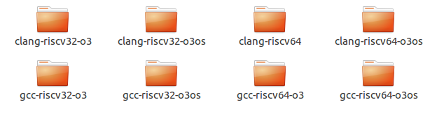
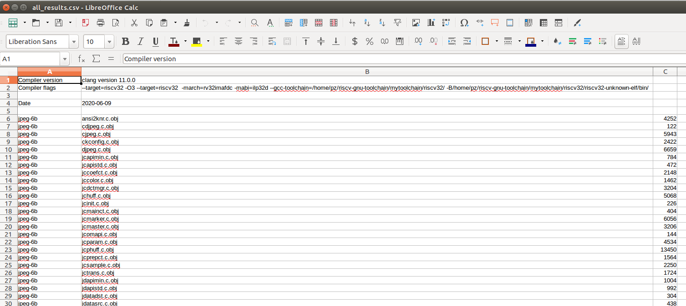
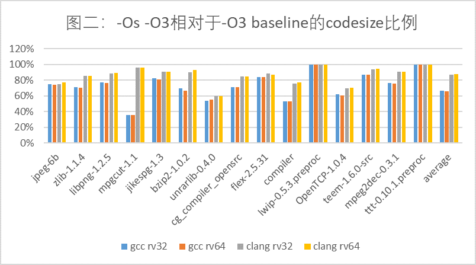
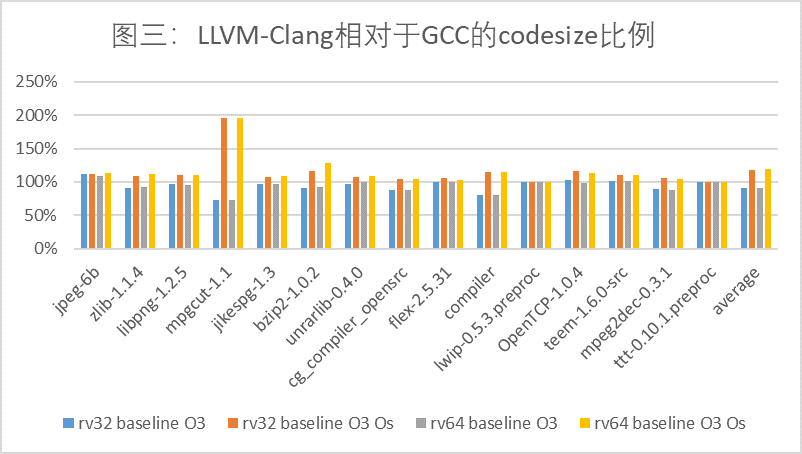

# 1 介绍

本文主要针对 “RISCV 工具链数据报第一期：CodeSize面面观” 复现实验过程，即对 GNU 和 LLVM-Clang toolchain ，利用 CSiBE benchmark 进行 codesize 方面的对比。

# 2 Toolchain 的源码及构建

## 2.1 编译构建 riscv-gnu-toolchain

**下载源码：**

```
git clone --recursive https://github.com/riscv/riscv-gnu-toolchain
```

由于网速问题，构建源码来自：https://mirror.iscas.ac.cn/plct

**安装依赖：**

```
sudo apt-get install autoconf automake autotools-dev curl python3 libmpc-dev libmpfr-dev libgmp-dev gawk build-essential bison flex texinfo gperf libtool patchutils bc zlib1g-dev libexpat-dev
```

**编译:**

```
vim ~/.bashrc
```

在最后增加，

```
export  RISCV32=/home/pz/riscv-gnu-toolchain/mytoolchain/riscv32
export  RISCV64=/home/pz/riscv-gnu-toolchain/mytoolchain/riscv64
export PATH=$PATH:$RISCV32/bin
export PATH=$PATH:$RISCV64/bin
```

```
cd riscv-gnu-toolchain
mkdir build
cd build
./configure  --prefix=$RISCV32 --with-arch=rv32gc --with-abi=ilp32d
make

./configure  --prefix=$RISCV64 --with-arch=rv64gc --with-abi=lp64d
make
```

## 2.2 编译构建 LLVM-Clang

```
git clone https://github.com/llvm/llvm-project.git

cd llvm-project
mkdir build && cd build
cmake -DCMAKE_INSTALL_PREFIX=/home/pz/llvm-project-master/llvm_install -DCMAKE_BUILD_TYPE="Release" -DLLVM_TARGETS_TO_BUILD="RISCV" -DLLVM_ENABLE_PROJECTS="clang;lld" -DLLVM_LINK_LLVM_DYLIB=ON -G "Unix Makefiles" ../llvm

make -j4
make install
```

初次构建 LLVM 似乎总会因为交换空间不足报错：`collect2:fatal error:ld terminated with signal 9`

因此增加设备的交换空间：

```
sudo su
dd if=/dev/zero of=/tmp/swap1 bs=1M count=10000
free -m //查看交换空间大小
mkswap /tmp/swap1
swapon /tmp/swap1
//若以上操作执行完，出现不安全的权限提示
chmod -R 0600 /tmp/swap1
```

commit id: e5158b52730d323bb8cd2cba6dc6c89b90cba452

clang version: 11.0.0

# 3 使用 CSiBE benchmark 得出实验结果

```
git clone https://github.com/szeged/csibe.git
cd csibe

./csibe.py --build-dir=./temp/ --toolchain clang-riscv32-o3 CSiBE-v2.1.1
./csibe.py --build-dir=./temp/ --toolchain clang-riscv32-o3os CSiBE-v2.1.1
./csibe.py --build-dir=./temp/ --toolchain clang-riscv64 CSiBE-v2.1.1
./csibe.py --build-dir=./temp/ --toolchain clang-riscv64-o3os CSiBE-v2.1.1

./csibe.py --build-dir=./temp/ --toolchain gcc-riscv32-o3 CSiBE-v2.1.1
./csibe.py --build-dir=./temp/ --toolchain gcc-riscv32-o3os CSiBE-v2.1.1
./csibe.py --build-dir=./temp/ --toolchain gcc-riscv64-o3 CSiBE-v2.1.1
./csibe.py --build-dir=./temp/ --toolchain gcc-riscv64-o3os CSiBE-v2.1.1
```

以上命令执行时，会在线下载 CSiBE-v2.1.1 源码压缩包，终端一直是downloading的状态，于是提前下载好这个源码包，放到特定的位置，可以加快执行速度。

并且，在`/csibe/toolchain-files/`目录下新增以下8个文件指定我们的工具链和编译选项，这8个文件位于 `/20200610-RISCV-CodeSize-data/codes` 目录下。

于是，可在 `/csibe/tmp/` 文件夹下对于上述8个不同的工具链选项产生8个相应的结果文件。





以上产生的数据文件存放在 ` /20200610-RISCV-CodeSize-data/raw_all_results/` 目录下，按照 RISCV 工具链数据报第一期的处理方法，对以上数据整理可以得到类似的结果。对比图如下：






