# 1介绍

本文主要针对 “RISCV 工具链数据报第二期：CodeSize ARM vs RISCV 和 RISCV IDE 评测” 复现实验过程。实验过程分为两部分，第一部分是基于 GNU toolchain 和 CSiBE 对 ARM 和 RISCV 的codesize进行测试和对比；第二部分是对 RISCV IDE 的测评。

# 2 Part1 ARM 和 RISCV 的 codesize测试和对比

测评使用的 ARM toolchain依然来自 https://www.linaro.org/downloads/ 页面的 Latest Linux Targeted Binary Toolchain Releases 的 Binaries，解压后目录列表为：

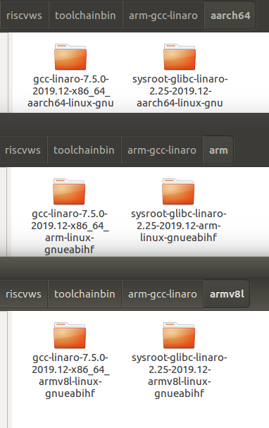


测评使用的 RISCV32 和 RISCV64 的 toolchain，同第一期所用。

测试对照组和编译选项依照数据报第二期，相应的`.cmake` 文件附在`/20200612-RISCV-ARM-RVIDE-data/codes/` 目录下，得到的 codesize 测试结果如下：

表1：12个测试用例平均每个文件的text段字节数绝对值

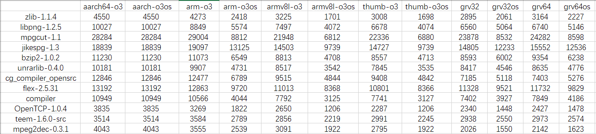


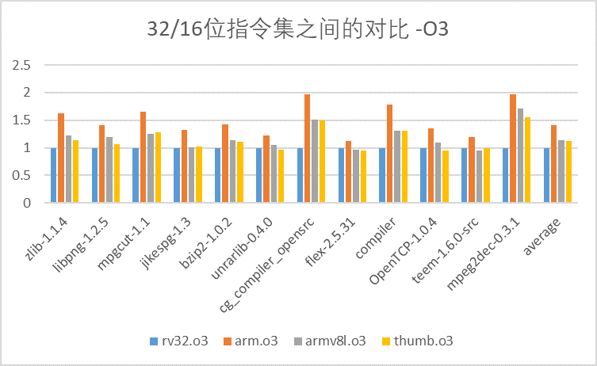


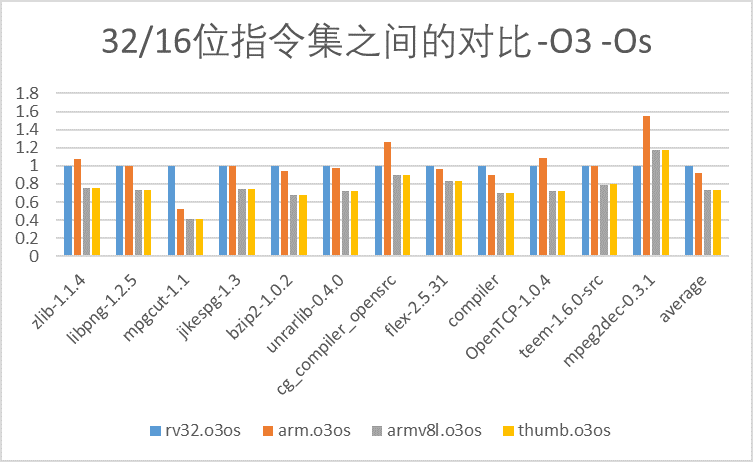


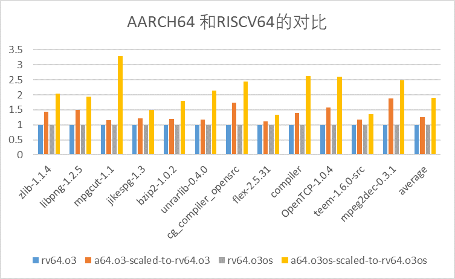

上述结果同数据报第二期结果有细微差别，但总体趋势类似；差别比较大的是 AARCH64 对比 RISCV64 位指令集下 codesize 的膨胀比例，-O3选项下，AARCH64 的codesize 平均比 RISCV64 大37%（数据报中为27%）；-O3 -Os选项下，AARCH64 的codesize 平均比 RISCV64 大111%（数据报中为3%）。


# 3 Part 2 RISCV IDE

测试方法：使用相同的编译选项对比 RISCV IDE 内嵌的toolchain 与 GNU 官方相同基础版本的 codesize 指标。

评测的目标程序：

-  dhrystone
-  coremark
-  gd32vf103c-Running_Led


下载最新版本的windows msi安装包（commit-id：d6f1ff8ba8a47c569d3a7e0ce4475923379482c7），解压安装完成后，新建一个spike工程，添加相应的编译选项，编译dhrystone benchmark，程序能够成功编译和链接。

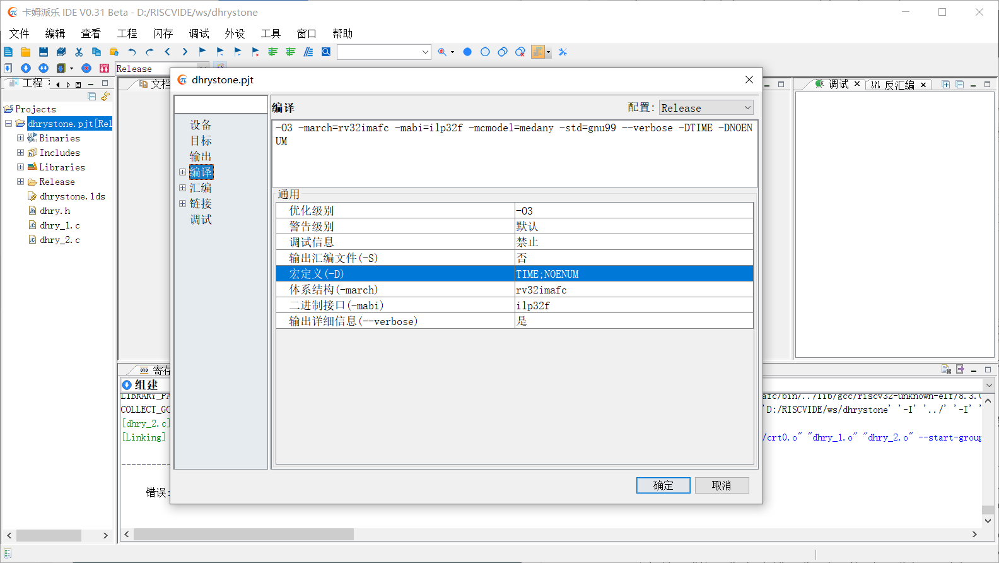

--verbose选项输出的该IDE内嵌编译器的各组件和configure信息如下：

```
COLLECT_GCC=/compiler/rv32imafc/bin/riscv32-unknown-elf-gcc
Target: riscv32-unknown-elf
Configured with: /cygdrive/e/src/riscv-gnu-toolchain/build_rv32imafc/../riscv-gcc/configure --target=riscv32-unknown-elf --prefix=/opt/rv32imafc --disable-shared --disable-threads --disable-tls --enable-languages=c,c++ --with-system-zlib --with-newlib --with-sysroot=/opt/rv32imafc/riscv32-unknown-elf --disable-libmudflap --disable-libssp --disable-libquadmath --disable-libgomp --disable-nls --src=../../riscv-gcc --enable-checking=yes --disable-multilib --with-abi=ilp32f --with-arch=rv32imafc --with-tune=rocket 'CFLAGS_FOR_TARGET=-Os  -mcmodel=medlow' 'CXXFLAGS_FOR_TARGET=-Os  -mcmodel=medlow'
Thread model: single
gcc version 8.3.0 (GCC) 
GNU C99 (GCC) version 8.3.0 (riscv32-unknown-elf)
GNU assembler version 2.32 (riscv32-unknown-elf) using BFD version (GNU Binutils) 2.32
```

对比测试的工具链：使用 https://github.com/riscv/riscv-gnu-toolchain.git 提供的构建脚本和目录，将 riscv-gcc 目录（当前9.2.0版本）的代码替换成从 https://ftp.gnu.org/gnu/gcc/gcc-8.3.0 下载的 gcc-8.3.0.tgz，构建一个RISCV32 交叉工具链。

构建选项：

```
./configure --prefix=$RISCV32GCC8_3_0 --with-arch=rv32imafc --with-abi=ilp32f
make
```

用上述构建完成的 GNU 官方工具链，编译 dhrystone 和 coremark 测试集， 

```
riscv32-unknown-elf-gcc -march=rv32imafc -mabi=ilp32f -c dhry_1.c dhry_2.c -DTIME -DNOENUM -fno-builtin-printf -fno-common -falign-functions=4 -O2
```

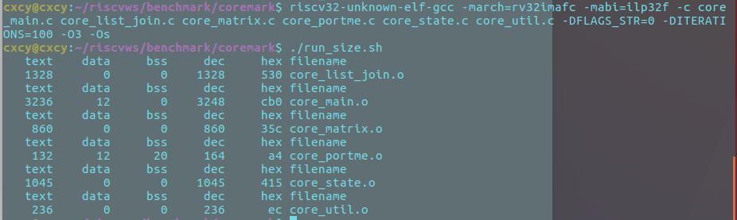

编译 RISCV IDE 中提供的 gd32vf103c 的 Running_Led 工程，编译链接选项和 RISCV IDE 默认的选项一致：

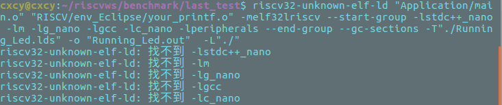

上述出现找不到库文件的错误，将相应的库文件地址加上，执行到链接又出现`can't link single-float modules with soft-float modules  ` 提示：

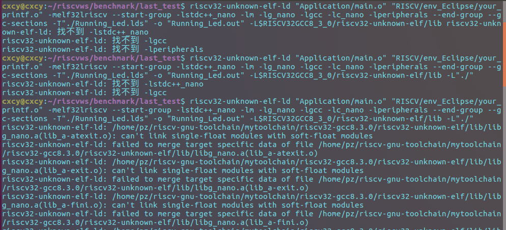

根据 https://github.com/riscv/riscv-gnu-toolchain/issues/356 的回答，构建工具链时添加`--enable-multilib`解决上述问题。于是重新构建要用的工具链：

```
./configure --prefix=$RISCV32GCC8_3_0 --with-arch=rv32imafc --with-abi=ilp32f --enable-multilib
make
```

重新编译上述程序（编译链接选项信息由 RISCV IDE 编译完成后导出，附于 `20200612-RISCV-ARM-RVIDE-data/run.sh` 文件中，如下：)

```
riscv32-unknown-elf-gcc -march=rv32imac -mabi=ilp32 -mcmodel=medlow -msmall-data-limit=8 -O2 -fmessage-length=0 -fsigned-char -ffunction-sections -fdata-sections -fno-common -I"./Application" -I"./Utilities/LCD_common" -I"./Peripherals/Include" -I"./Peripherals" -I"./RISCV/drivers" -I"./Utilities" -I"./Application" -I"./"  -c "./Application/main.c" -o "Application/main.o"

riscv32-unknown-elf-gcc -march=rv32imac -mabi=ilp32 -mcmodel=medlow -msmall-data-limit=8 -O2 -fmessage-length=0 -fsigned-char -ffunction-sections -fdata-sections -fno-common -I"./RISCV/env_Eclipse" -I"./Utilities/LCD_common" -I"./Peripherals/Include" -I"./Peripherals" -I"./RISCV/drivers" -I"./Utilities" -I"./Application" -I"./"  -c "./RISCV/env_Eclipse/your_printf.c" -o "RISCV/env_Eclipse/your_printf.o"

riscv32-unknown-elf-ld "Application/main.o" "RISCV/env_Eclipse/your_printf.o" -melf32lriscv --start-group -lstdc++_nano -lm -lg_nano -lgcc -lc_nano -lperipherals --end-group --gc-sections -o "a2.out" -T"./Running_Led.lds" -L$RISCV32GCC8_3_0/riscv32-unknown-elf/lib -L$RISCV32GCC8_3_0/riscv32-unknown-elf/lib/rv32imac/ilp32 -L"./" -L$RISCV32GCC8_3_0/lib/gcc/riscv32-unknown-elf/8.3.0/rv32imac/ilp32
```

可以成功编译程序。

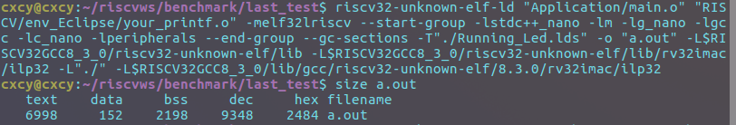

3个评测程序的完整的评测结果如下：

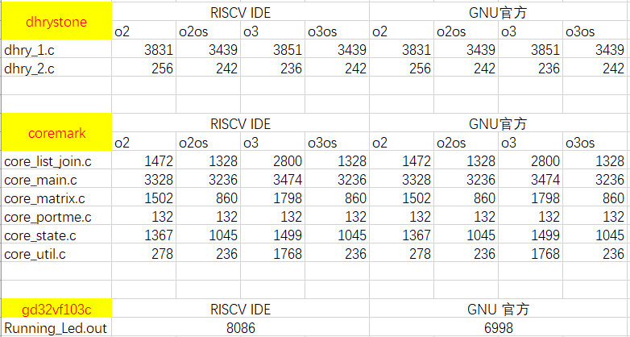

结论：dhrystone与coremark测试集程序结果与数据报第二期结果一致，两个工具链的 codesize 完全一致；但是，gd32vf103c 的 Running_Led 程序测试结果不同，原因未明。

