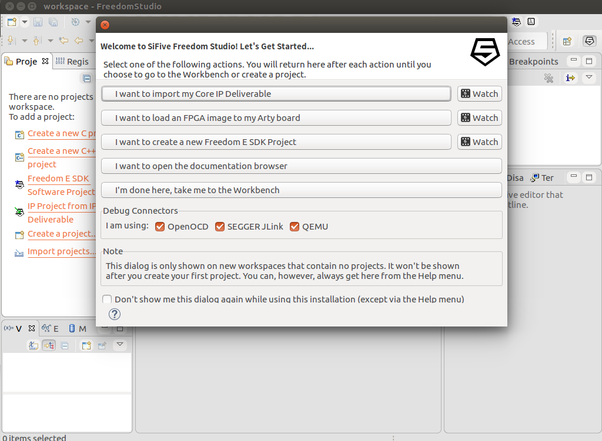
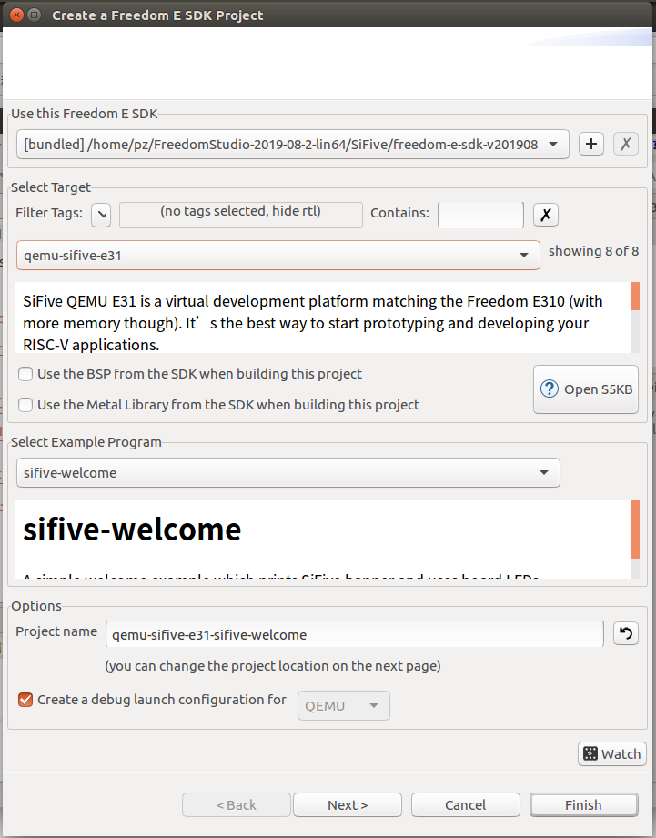
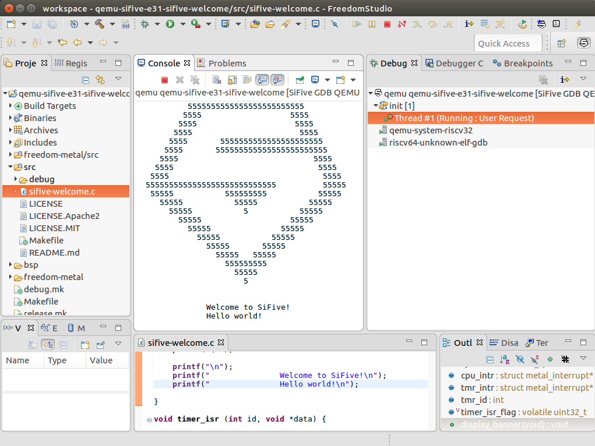
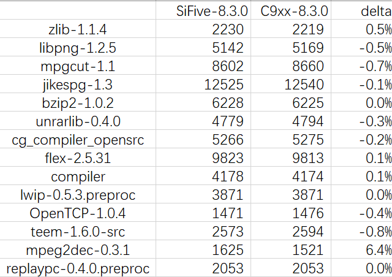

# 1 介绍

本文主要针对 “RISCV 工具链数据报第三期“ 复现实验过程，即对 SiFive FreedomStudio 和 SiFive prebuilt toolchain ，以及平头哥所提供的 buildroot 所包含的工具链，利用 CSiBE benchmark 进行相关评测。

# 2 SiFive FreedomStudio

下载地址：https://www.sifive.com/boards

 SiFive FreedomStudio 目前最新Linux版本为 v2019.08.2，下载后解压，直接执行 FreedomStudio 即可启动。

启动时界面：

 

创建一个`qemu-sifive-e31 target` :

 

运行得到输出：

 

# 3 SiFive prebuilt toolchain 和平头哥所提供的 buildroot 所包含的工具链 的codesize 对比

工具链来源：

- https://www.sifive.com/boards 下载的 prebuilt toolchain，gcc版本8.3.0，binutils：2.32。

- https://occ.t-head.cn/community/download?id=575996958993285120 处下载的buildroot包，buildroot:thead_9xx_compat_5.4_glibc_br_defconfig 4fcb14dc3b493b89aa353c6eabaf7f01a09586dd，gcc:8.3.0， binutils:2.31.1（https://gitlab.com/c-sky/buildroot/-/jobs/583041349/artifacts/browse/output/images/）

  

利用 CSiBE 进行评测，结果如下，两者差别不大。结果与第三期结果一致。原始数据结果附于 `20200615-EB-RISCV-data/raw_results/` 目录下。

