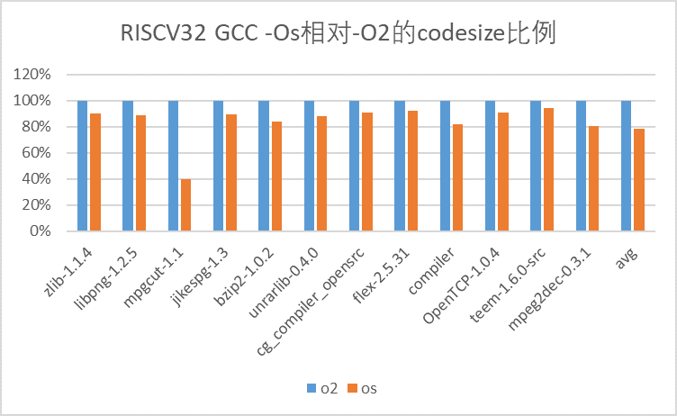
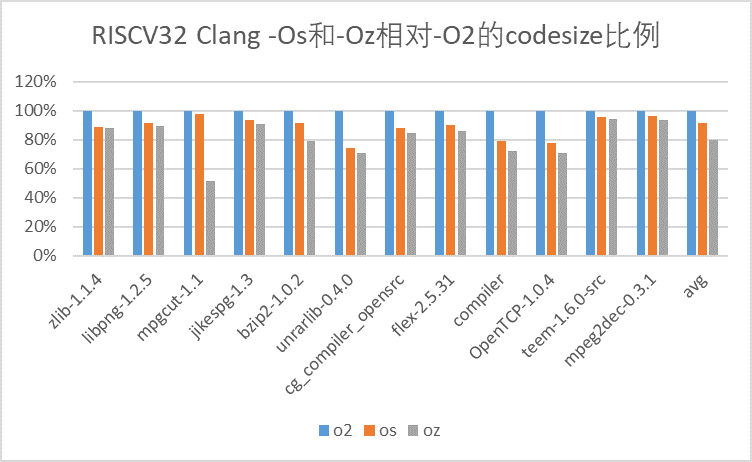
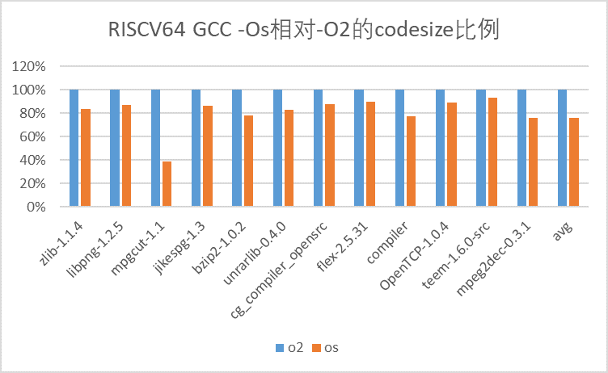
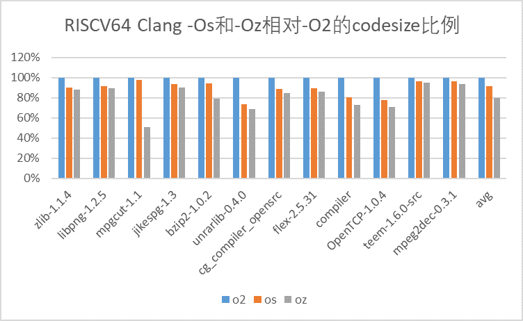
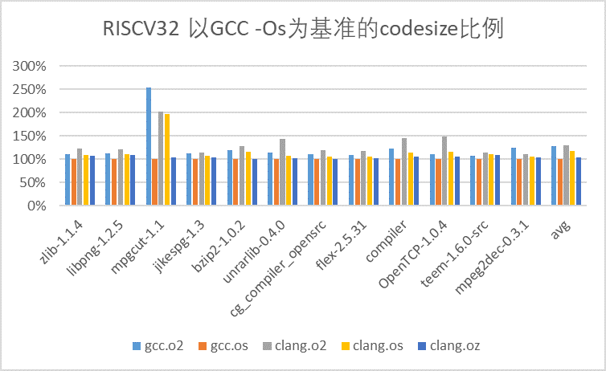
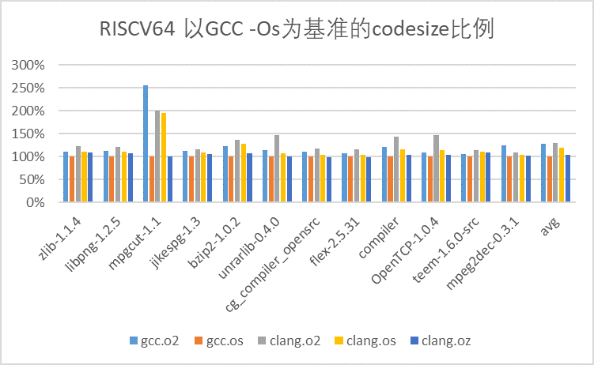
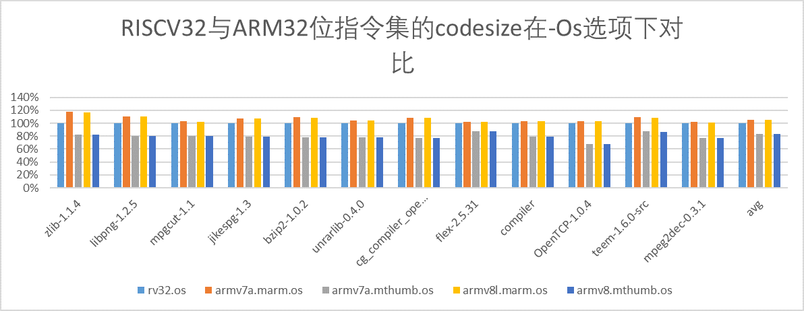
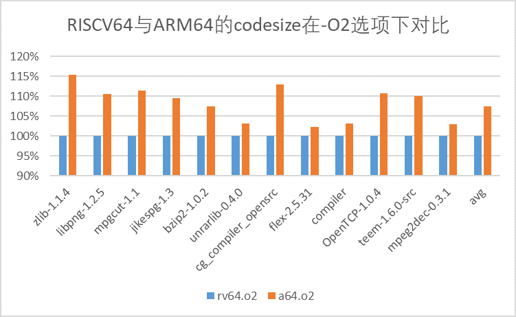
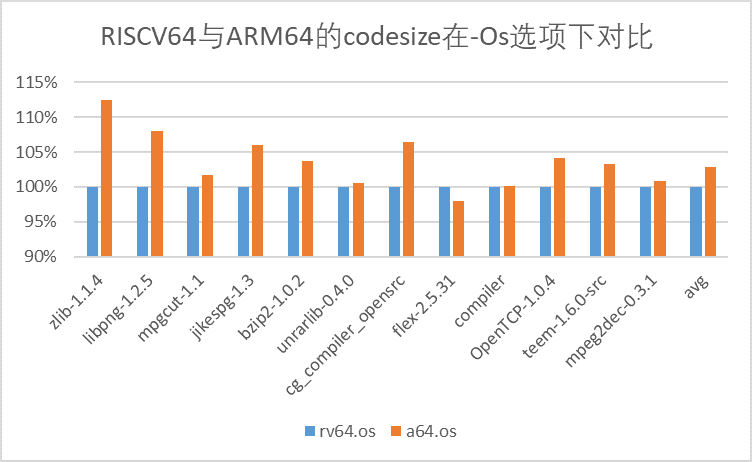
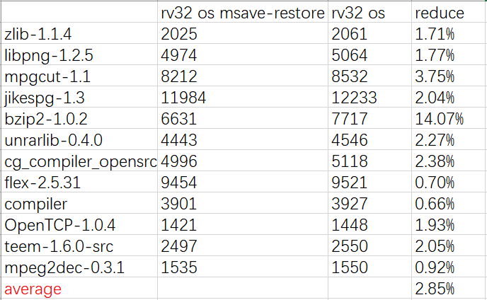

本文主要针对 “RISCV 工具链数据报第四期“ 复现实验过程，所用工具链的源码及构建方式同`20200610-RISCV-Codesize.md` 所述；使用 CSiBE 工具集进行测试；优化选项的使用同第四期数据报所述。

数据结果与原报文结果有微小差异，但大体结果一致，原始数据附于 `20200616-EB-4-RISCV-data/raw_results` 中，下面直接贴出数据分析结果：

图一：RISCV32 GCC 的 -Os 与 -O2 选项对比：

图二：RISCV32 Clang 的 -Os -Oz 与 -O2 选项对比：

图三：RISCV64 GCC 的 -Os 与 -O2 选项对比：

图四：RISCV64 Clang 的 -Os -Oz 与 -O2 选项对比：

图五：RISCV32 GCC 与 Clang 的对比：

图六：RISCV64 GCC 与 Clang 的对比：

图七：GCC RISCV32 -O2 与 GCC ARM32 -O2 的对比：

图八：GCC RISCV32 -Os 与 GCC ARM32 -Os 的对比：

图九：GCC RISCV64 -O2 与 GCC AARCH64 -O2 的对比：

图十：GCC RISCV64 -Os 与 GCC AARCH64 -Os 的对比：

图十一：GCC RISCV32 -Os 与 -Os -msave-restore 选项对比：

